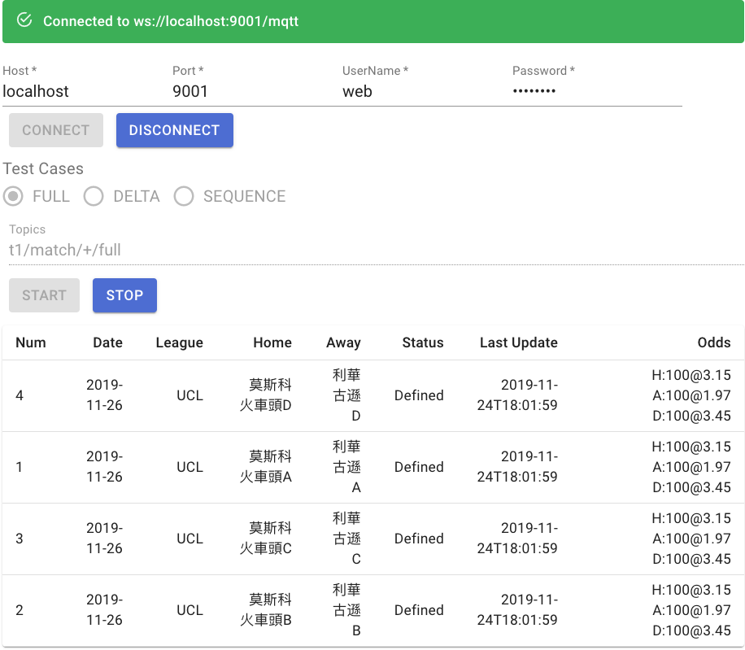

# Realtime Odds Demo

This is a demo to show how to use Solace PS+ broker to deliver real-time odds event to the mqtt client in different mode:

1. **FULL** mode: the client will receive each event with full information of the Match
1. **DELTA** mode: In most cases, the client will only receive delta messages, it will consume much less bandwidth (less than 1/10)  compare to the FULL mode
1. **SEQUENCE** mode, it will show out the sequence number of each event, and if the web app detects event lost, it will ask the broker to resend events



## Solace PS+ Broker Setup

1. [Installing PS+ Cache](https://docs.solace.com/Solace-PubSub-Cache/Installing-PubSub-Cache.htm)
1. Create a Distributed Cache with name `MatchCache` to listen on topic "t1/match/>"
1. Enable Mqtt service

## How to build the demo

### Web App

Please install [Node](https://nodejs.org/) to build this web app.

```bash
cd webapp
yarn install
yarn build
```
### Cache Proxy

Please install [gradle](https://gradle.org/) to build this project.

```bash
cd cacheProxy
gradle build
```


## How to run the demo

### Start the cache proxy

```bash
cd cacheProxy
./run_match.sh
+ java -cp ./build/libs/cacheproxy-0.1.jar cacheproxy.Proxy -h localhost -u cache@Match -w cache -m 20
13:28:07.312 main INFO  [BaseApp]: Proxy / JCSMP 10.8.0
13:28:07.312 main INFO  [BaseApp]: ===================================================
13:28:07.666 main DEBUG [Proxy]: Start to connect session
13:28:07.776 main DEBUG [Proxy]: Create message consumer
13:28:07.812 main DEBUG [Proxy]: Listen on the cache request topic: cacheproxy/request
13:28:07.819 main DEBUG [Proxy]: Connected. Awaiting message...
----------------------------Press Ctrl+C to exit ...----------------------------
```

### Start the WebApp

You could start it in develop mode with `yarn start`  then open http://localhost:3000/ to see this app, or setup a web server to serve the `./build` folder

### Publish sample data

First, please update the `SDKPERF` var inside the `./pubMatchs.sh` shell file to the sdkperf tools of your machine, then run ``./pubMatchs.sh times`. It will send Match information every two seconds for `times` times.

```bash
./pubMatchs.sh 3
Mon Apr 27 16:00:21 CST 2020
match0-0.json
match1-0.json
match2-0.json
match3-0.json
Mon Apr 27 16:00:23 CST 2020
match0-1.json
match1-1.json
match2-1.json
match3-1.json
Mon Apr 27 16:00:25 CST 2020
match0-2.json
match1-2.json
match2-2.json
match3-2.json
```

